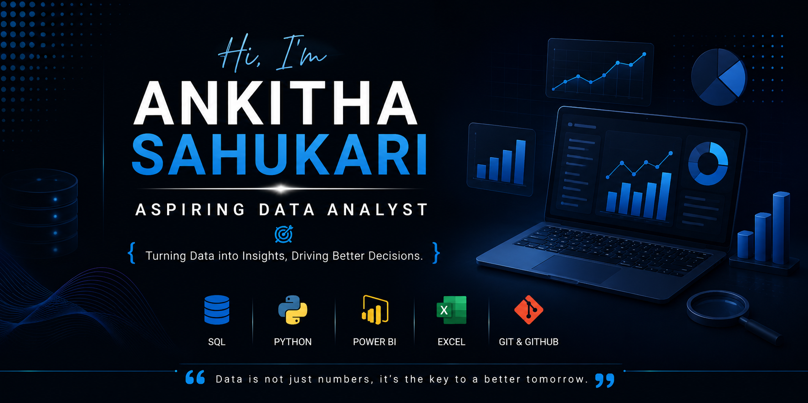

  

<h1 align="center">Hi 👋, I'm Ankitha Sahukari</h1>
<h3 align="center">📊 Aspiring Data Analyst | SQL • Python • Power BI • Excel</h3>

---

## 👩‍💻 About Me

- 🎓 B.Tech in Artificial Intelligence
- 📊 Aspiring Data Analyst passionate about turning data into meaningful insights.
- 🌱 Currently focusing on **SQL, Python, Power BI, Excel, and git&github**.
- 🚀 Building real-world Data Analytics projects to strengthen my skills.
- 🎯 Goal: To become a Data Analyst and solve business problems using data.

---

## 🛠️ Tech Stack

## 📂 Featured Projects

### 📊 Blinkit Grocery Sales Analytics
- Built an interactive Power BI dashboard to analyze sales performance.
- Used SQL and Excel for data cleaning and analysis.

### 💰 AI Bank Loan Risk Intelligence System
- Developed a Machine Learning model to predict loan risk.
- Built dashboards using Power BI and created a Streamlit web application.

---

## 📈 GitHub Stats

---

## 🌐 Connect with Me

- 💼 LinkedIn: https://www.linkedin.com/in/ankitha-sahukari-458917315?utm_source=share_via&utm_content=profile&utm_medium=member_android
- 📧 Email: ankithasahukari@gmail.com

---

⭐ **Thank you for visiting my profile! Feel free to explore my repositories and connect with me.**
